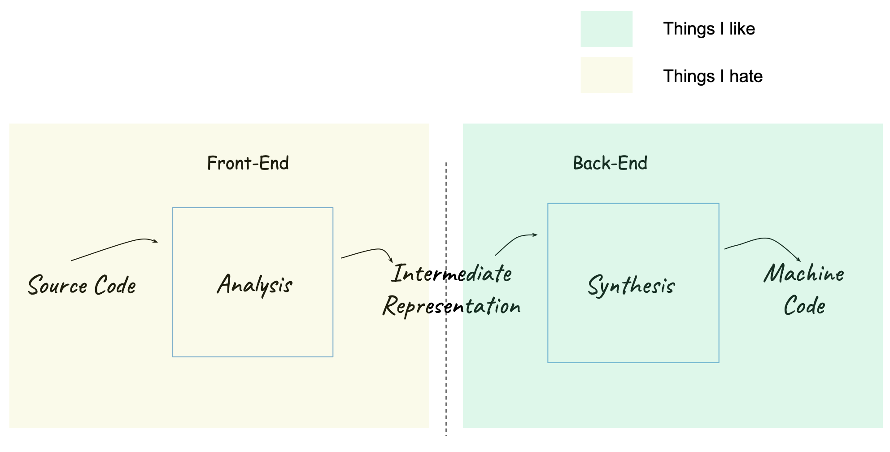

# compiler-repo

> For every extra cycle an hardware engineer can squeeze out of silicon, you will find a programmer adding one hundred cycles to their program.

### Compiler 101
[Compiling Process](https://fabiensanglard.net/dc/)

[Restrict Keyword in C](https://ckrisgarrett.github.io/restrict.html)

[Register Spilling](https://johnnysswlab.com/decreasing-the-number-of-memory-accesses-the-compilers-secret-life-2-2/)

[Register Allocation](http://web.cecs.pdx.edu/~mperkows/temp/register-allocation.pdf)

### Comp Architecture 

[Modern Micorprocessors - Pipelining, ILP, Super Scalar, Branch Prediction, Regiter Renaming, OOO](https://www.lighterra.com/papers/modernmicroprocessors/)

[Memory Consistency Models: A Tutorial](https://www.cs.utexas.edu/~bornholt/post/memory-models.html)

[Predication: To reduce pipeline stalls due to control hazards](https://www.icsa.inf.ed.ac.uk/research/groups/hase/models/dlx-pred/)

[Return Address Stack](https://blog.stuffedcow.net/2018/04/ras-microbenchmarks/)

[Guide for Performance Engineers](https://en.algorithmica.org/hpc/)

### Micro Arch

[ARM’s Cortex A53: Tiny But Important](https://chipsandcheese.com/2023/05/28/arms-cortex-a53-tiny-but-important/)

### Tools
[Compiler Explorer](https://godbolt.org/)

[A64 SIMD Instruction List: SVE Instructions](https://dougallj.github.io/asil/index.html)

[ARM Instrinsics](https://developer.arm.com/architectures/instruction-sets/intrinsics)

### Courses
[Cornell CS 6120: Advanced Compilers](https://www.cs.cornell.edu/courses/cs6120/2020fa/self-guided/)

[vectorization is the holy grail of software optimizations](https://johnnysswlab.com/vectorization-dependencies-and-outer-loop-vectorization-if-you-cant-beat-them-join-them/)

### Optimization Stories

[Quake’s Fast Inverse Square Root](https://betterexplained.com/articles/understanding-quakes-fast-inverse-square-root/)

[Optimizing 128-bit Division](https://danlark.org/2020/06/14/128-bit-division/)

[Scan HTML faster with SIMD ](https://lemire.me/blog/2024/06/08/scan-html-faster-with-simd-instructions-chrome-edition/)

[Beating the L1 cache with value speculation](https://mazzo.li/posts/value-speculation.html)

### Must Read
https://fabiensanglard.net/blog/

### Misc
[History of C Compilers](https://thechipletter.substack.com/p/a-history-of-c-compilers-part-1-performance)

[Compiling and optimization for high performance systems](https://www.es.ele.tue.nl/~heco/courses/ASCI-schools/ASCI_springschool_2017/CompilingFor%20HPCsystems.pdf)

### Books
[The Science of Programming Matrix Computations](https://www.cs.utexas.edu/~rvdg/tmp/TSoPMC.pdf)

[GAME ENGINE BLACK BOOK: WOLFENSTEIN 3D](https://fabiensanglard.net/gebbwolf3d/index.html)
